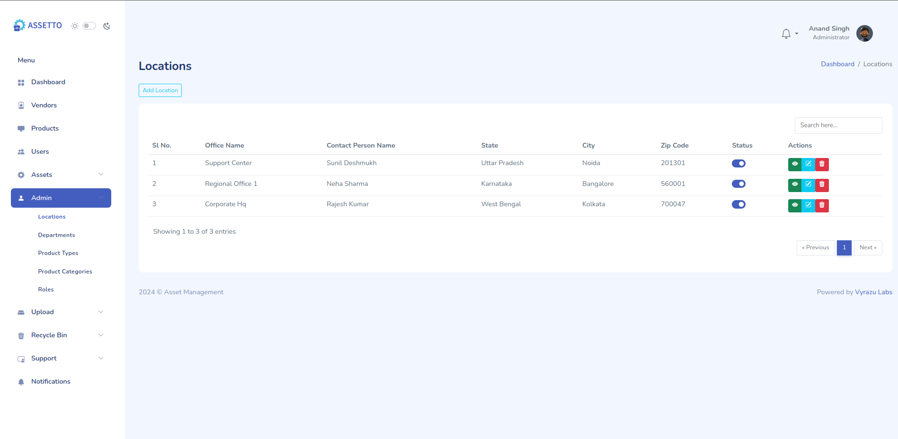
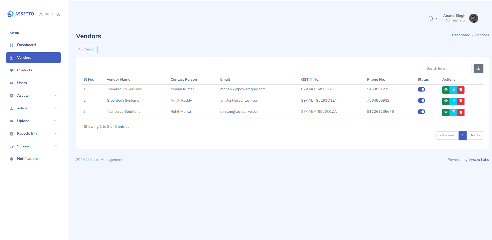
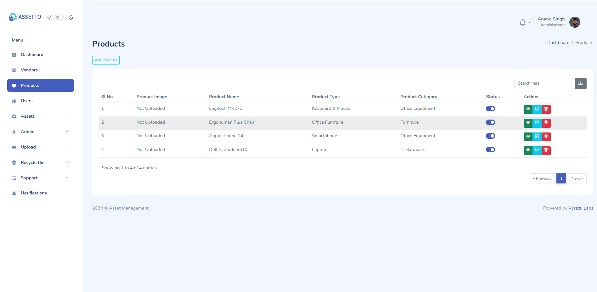
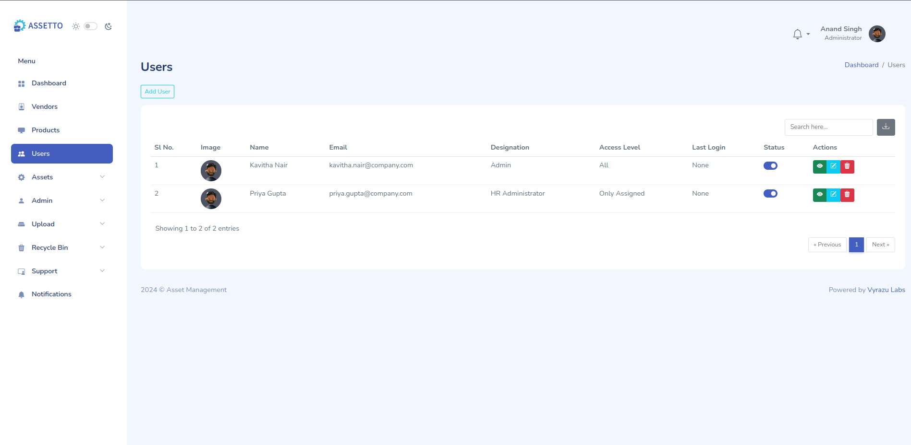
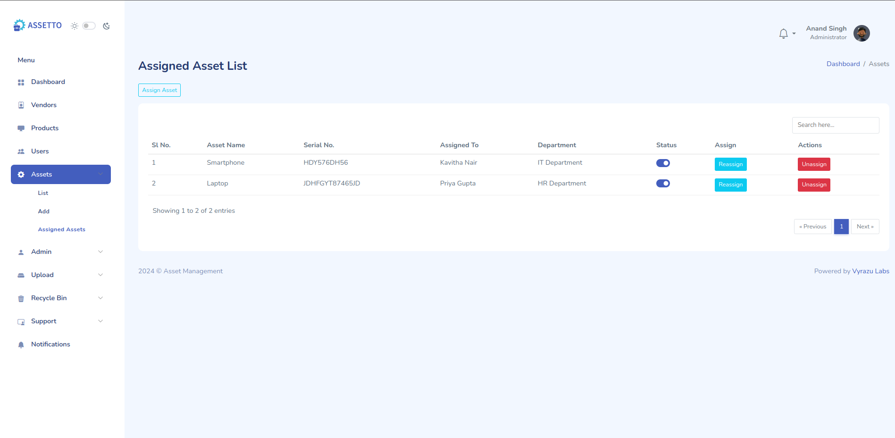
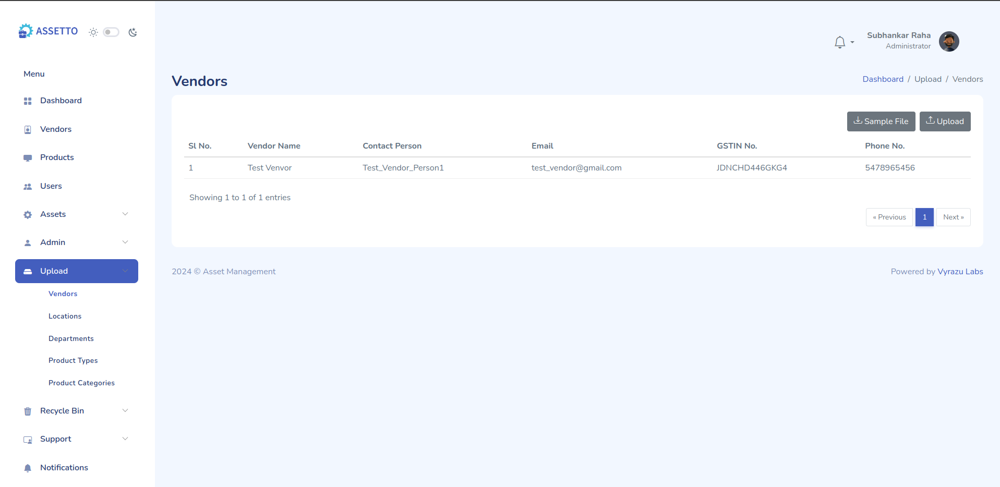
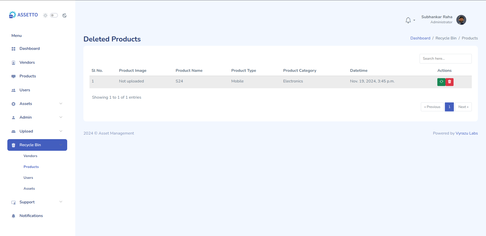

# Asset Management Project

## Overview

The Asset Management Project is a comprehensive solution designed to help organizations efficiently manage their assets. This project provides functionalities for asset information, maintenance, asset allocation to users under admin, and dashboard viewing. The system is built with a user-friendly interface.

## Table of Contents

- [Features](#features)
- [Installation](#installation)
- [Usage](#usage)
- [Unit Testing](#unit-testing)
- [Configuration](#configuration)
- [Contributing](#contributing)
- [License](#license)
- [Contact](#contact)

## Features

- **Admin**: Maintain detailed records of all Assigned Users, Locations, Departments, Product Types, Product Categories, and Roles. 
- **Dashboard**: Displays information like Assets, Assigned/Unassigned Assets, Vendors, Locations, Products, Users, and Total Asset Cost in a tabular format along with Upcoming Warranty Expiries and Recent Activities Performed in the dashboard.
- **Assets**: Assign people to assets by adding them and a list to display all the assigned people with their respective assets.
- **Upload**: To generate a sample file or upload them for all the displayed data of Vendors, Locations, Departments, Product Types, Product Categories.
- **Reporting and Analytics**: Generate reports on asset performance, utilization, and maintenance history.
- **User Management**: Role-based access control to secure sensitive asset information.
- **Integration**: API support for integrating with other enterprise systems.
- **Recycle Bin**: Contains all the previously deleted files by the admin and also has functionality to restore them.

## Installation

### Prerequisites

- [Python 3.9+](https://www.python.org/)
- [Mysql](https://www.mysql.com/) (Can be replaced by your preferred database)
- [Docker](https://www.docker.com/) (optional, for containerized deployment)

### Steps

1. Clone the repository:
    ```sh
    git clone https://github.com/yourusername/assetmanagement.git
    cd asseto-asset-management
    ```

2. Create and activate a virtual environment:
    ```sh
    python -m venv env
    source env/bin/activate  # On Windows use `env\Scripts\activate`
    ```

3. Install dependencies:
    ```sh
    pip install -r requirements.txt
    ```

4. Set up environment variables:
    ```sh
    cp .env.example .env
    ```
    Edit the `.env` file with your preferred settings.

5. Apply migrations:
    ```sh
    python manage.py migrate
    ```

6. Start the development server:
    ```sh
    python manage.py runserver
    ```

7. Open your browser and navigate to `http://localhost:8000`.

8. Create a superuser if necessary:
    ```sh
    python manage.py createsuperuser
    ```

## Usage

#### Try This Project with a Demo Account
You can use this project before downloading.
The project is hosted [here](https://asset-management-hg2x.onrender.com/login?next=/).\
\
Credentials:\
&nbsp;&nbsp;&nbsp;&nbsp; email: asset-management@demo.com \
&nbsp;&nbsp;&nbsp;&nbsp; password: DM4g476ZmQ$U

Log in with this credential and use the below features

### Admin


1. Navigate to the "Admin" section.
2. Admin consists of five sections: Locations, Departments, Product Types, Product Categories, and Roles.
3. Each section has its own functionalities where you can perform operations such as Add/Edit/Delete/View.

### Vendors


1. Navigate to the "Vendors" section.
2. Click the buttons as per your needs (Add/Edit/Delete/View vendors).
3. Fill in the vendor details and click Save.
4. Searching and downloading vendor details are also available. 

### Products


1. Navigate to the "Products" section.
2. Click the buttons as per your needs (Add/Edit/Delete/View products).
3. Fill in the product details and click Save.
4. Searching and downloading product details are also available.

### Users


1. Navigate to the "Users" section.
2. Click the buttons as per your needs (Add/Edit/Delete/View users).
3. Fill in the user details and click Save.
4. Searching and downloading user details are also available. 

### Assets


1. Navigate to the "Assets" section.
2. Click the buttons as per your needs (Add/Edit/Delete/View assets).
3. Fill in the asset details and click Save.
4. Assigned Assets also contain a list of all the assets assigned to different individuals with search functionalities and Reassign/Unassign features.

### Upload


1. Navigate to the "Upload" section.
2. Upload consists of five sections: Locations, Departments, Product Types, Product Categories, and Vendors.
3. Each section has its own functionalities where you may either upload the data or download a sample.

### Recycle Bin


1. The Recycle Bin contains all the previously deleted files by the admin and also has functionality to restore them, divided by category.

## Unit Testing

To ensure the quality and reliability of the system, unit tests are written to test various functionalities of the project. You can run the tests to verify that the project works as expected.

### Running Unit Tests

1. **Activate your virtual environment** (if not already activated):
    ```sh
    source env/bin/activate  # On Windows use `env\Scripts\activate`
    ```

2. **Run tests**:
    ```sh
    python manage.py test
    ```
    This will run all the tests across the project.

3. **Run tests for a specific app**:
    If you want to run tests from a specific app, use the app name:
    ```sh
    python manage.py test assets
    ```

4. **Verbose Output**:
    For more detailed output while running the tests, use the `-v` flag:
    ```sh
    python manage.py test -v 2
    ```

### Other Useful Commands

- **Show test results without resetting the database**:
    ```sh
    python manage.py test --keepdb
    ```

## Configuration

Configuration options are managed via the `.env` file. Key settings include:

- Database credentials
- SMTP server credentias
- Other service configurations

Copy the settings from `.env.example` to `.env` and modify as needed.

## Contributing

We welcome contributions! To contribute:

1. Fork the repository.
2. Create a new branch (`git checkout -b feature-branch`).
3. Make your changes and commit them (`git commit -m 'Add new feature'`).
4. Push to the branch (`git push origin feature-branch`).
5. Open a pull request.

Please ensure your code follows our [coding standards](CONTRIBUTING.md).

## License

This project is licensed under the MIT License. See the [LICENSE](LICENSE) file for more details.

## Contact

For any inquiries or support, please contact:

- Email: info@vyrazu.com
- Project Maintainer: [Vyrazu Labs Ltd](https://vyrazu.com/)
