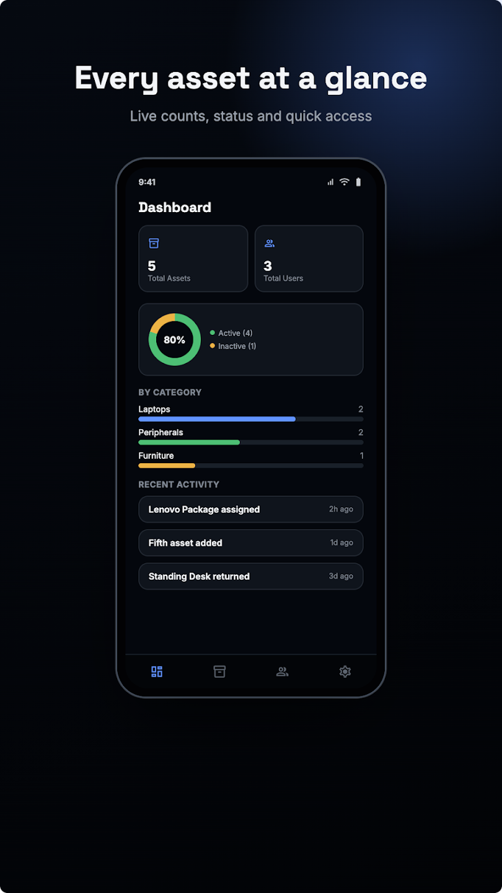
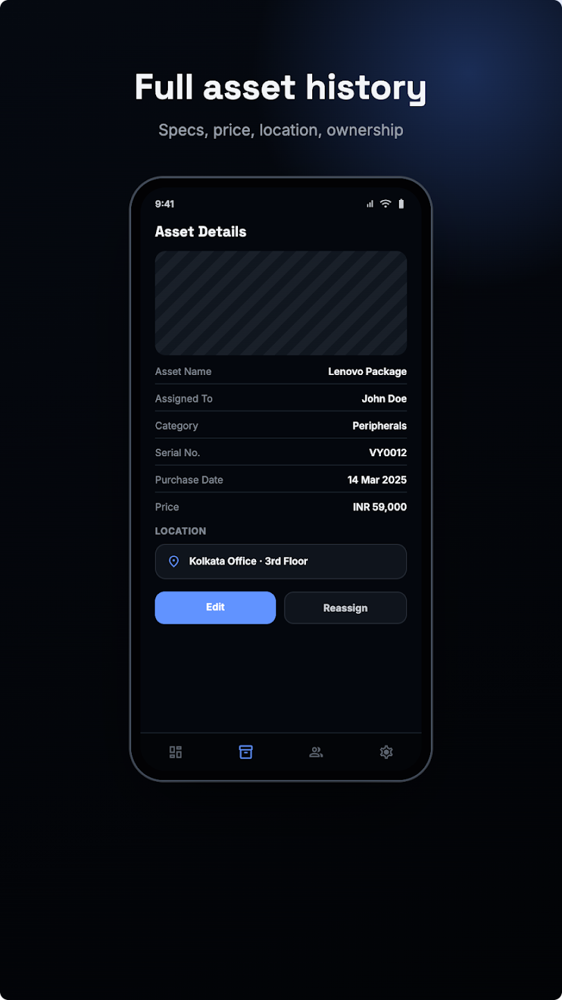
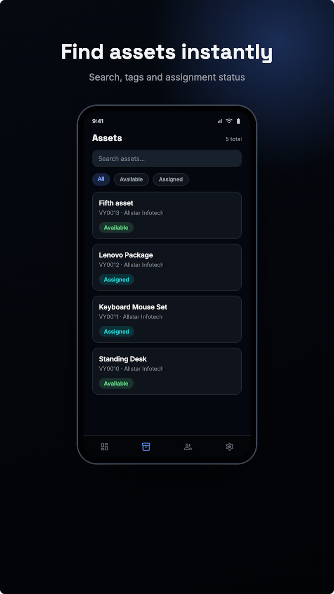
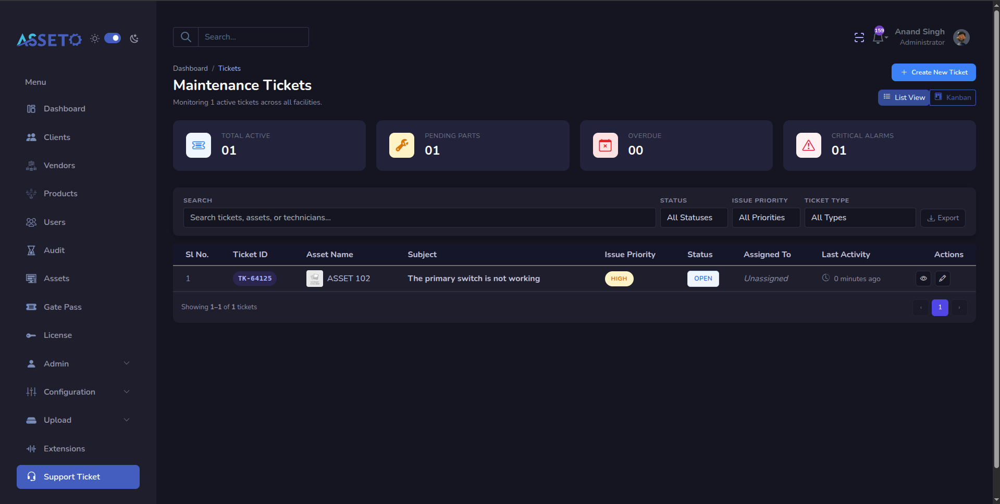

<div align="center">


**Open-source asset management for IT, facility, and operations teams — track custody, audit every change, and manage the full lifecycle of your hardware, equipment, and rentals from one dashboard.**

[-orange)](LICENSE.md)
[](https://www.python.org/)
[](https://www.djangoproject.com/)
[](CONTRIBUTING.MD)
[](https://github.com/VyrazuLabs/asseto-asset-management/stargazers)
[](https://github.com/VyrazuLabs/asseto-asset-management/network/members)
[](https://github.com/VyrazuLabs/asseto-asset-management/issues)

[🚀 Live Demo](https://asset-management-hg2x.onrender.com/login?next=/) · [📖 Roadmap](ROADMAP.md) · [🐛 Report Bug](https://github.com/VyrazuLabs/asseto-asset-management/issues) · [✨ Request Feature](https://github.com/VyrazuLabs/asseto-asset-management/issues)


</div>

## Try the Demo

> [!TIP]
> Explore a live instance before installing anything — no signup required.
> **[Open the demo →](https://asset-management-hg2x.onrender.com/login?next=/)**

| | Shared demo account |
|---|---|
| **Email** | `asset-management@demo.com` |
| **Password** | `DM4g476ZmQ$U` |

*This is a shared, resettable demo account — please don't store anything sensitive in it.*

## 📱 Mobile Application

Take full control of your asset management on the go! Asseto's **companion mobile app** brings the power of your dashboard directly to your pocket.

<p align="center">
  <a href="https://play.google.com/store/apps/details?id=com.vyrazu.asseto" target="_blank">
    
  </a>
  <a href="https://play.google.com/store/apps/details?id=com.vyrazu.asseto" target="_blank">
    
  </a>
  <a href="https://play.google.com/store/apps/details?id=com.vyrazu.asseto" target="_blank">
    
  </a>
</p>

### 🚀 Why You'll Love It:
- **Scan & Go:** Instantly audit and verify assets in the field by scanning QR codes.
- **Real-Time Sync:** Every assignment, repair, or status update reflects instantly on the web.
- **Manage Anywhere:** Track hardware, assign equipment, and oversee your inventory from anywhere.

<a href="https://play.google.com/store/apps/details?id=com.vyrazu.asseto" target="_blank">**Download Asseto on Google Play →**</a>

## Why Asseto?

Most teams still track laptops, equipment, and rented assets in spreadsheets — no custody trail, no audit history, and no way to prove who had what when it matters. Asseto replaces that with a single system of record: every assignment, repair, and modification is logged automatically, deleted records land in a recoverable Recycle Bin, and access is governed by custom roles and two-factor authentication. It ships with a REST API, Slack and Firebase push notifications, and a companion Flutter mobile app for physical audits in the field.

**Built on Django 5.2**, actively developed with frequent releases. Self-hostable, and free for commercial use under the [Vyrazu License](LICENSE.md).

---

### 🔒 Security

To report a security vulnerability, please email **[security@vyrazu.com](mailto:security@vyrazu.com)** instead of using the issue tracker. See [SECURITY.md](SECURITY.md) for details.

### 📋 Latest Releases

Check the [Releases page](https://github.com/VyrazuLabs/asseto-asset-management/releases) for version history and [CHANGELOG.md](CHANGELOG.md) for recent updates.

## Table of Contents

- [Features](#features)
- [Screenshots](#screenshots)
- [Quick Start](#quick-start)
- [Security](#-security)
- [Two-Factor Authentication](#two-factor-authentication-2fa)
- [Notifications & Firebase](#notifications--firebase-integration)
- [Testing](#testing)
- [Configuration](#configuration)
- [Roadmap](#roadmap)
- [Contributing](#contributing)
- [Releasing](#releasing)
- [License](#license)
- [Contact](#contact)

## Features

### Security, Auditing & Administration

- **Audit Logs & Soft Delete**: Every administrative change is logged automatically; deleted records are recoverable from a central Recycle Bin.
- **Two-Factor Authentication (2FA)**: TOTP authenticator-app verification on top of password login.
- **Role-Based Access Control**: Custom workspace roles restrict both interface access and per-action permissions.

### Core Asset Lifecycle & Inventory

- **Admin Dashboard**: Central records for Assigned Users, Locations, Departments, Product Types, Product Categories, and Roles.
- **Asset Assignment & Custody**: Assign assets to users, track reassignments, and keep active custody logs.
- **Asset Configuration Management**: Custom specification fields and category-based templates for diverse asset classes.
- **Asset Repair Logs**: Repair histories, maintenance costs, status changes, and servicing vendors.
- **Consumables Management**: Track consumable stock with full purchase context — vendor, item/order numbers, purchase date, and cost. Check out quantities to users with automatic remaining-stock decrement and checkout history, set minimum-quantity thresholds that trigger automatic low-stock alerts, attach receipts/invoices and images to each consumable, and search or import your inventory with soft-delete recovery.
- **Bulk Uploads**: Import Assets, Vendors, Locations, Departments, Categories, and Products via CSV templates.

### Gate Pass Management

- **Inward & Outward Asset Movement**: Securely initiate and manage asset movements across your facilities.
- **Approval Workflows**: Authorized users can approve or reject gate pass requests with complete audit logs.
- **Prevent Duplicate Movement**: Lock assets with pending gate passes to prevent duplicate movement requests.
- **QR Code Verification**: Print gate pass documents with QR codes for instant physical scanning and automated status updates.

### Configurations

- **Universal Custom Fields**: Create a custom field once and use it universally across Assets, Users, Products, Vendors, and Clients to standardize unique organizational data.
- **Branding**: Customize system logos, login page branding, and favicon to match your company's brand identity.
- **Tag Configurations**: Generate and manage custom asset tags
- **Localization**: Configure local standard currencies, date formats, and multi-language interface preferences. Complete interface internationalization (i18n) for global teams.
- **Organization Settings**: Set and manage company profiles, organization details, and global workspace defaults.

### Integration & Multi-Channel Sync

- **REST API**: Secure endpoints to read and synchronize asset data with external systems.
- **Slack Integration**: Push immediate alerts and updates to Slack workspace channels.(Improving)
- **Flexible Notifications**: Multi-channel notifications across Email and Firebase (FCM) push alerts.(Improving)
- **Mobile Application**: Flutter-based companion app for remote management and physical audits.

### Portals & Customer Support

- **Client Module**: Register and manage external clients within the system. Control access via the *Client Portal Access* toggle, allowing clients to log in securely with passwordless OTP verification sent to their registered email.
- **Support Ticket Module**: Manage asset service and maintenance requests with List and Kanban views. Includes drag-and-drop status transitions, ticket lifecycle tracking, and built-in comment/conversation threads for seamless communication between admins and clients.
- **Client Portal**: Empower clients with a dedicated self-service portal to view all assigned assets, track active support tickets, and submit new issues directly against their hardware inventory.

## Screenshots

<details open>
<summary><b>Admin Section</b> — manage Locations, Departments, Product Types, Categories, and Roles</summary>


- Navigate to the **Admin** section in the side menu.
- Manage Locations, Departments, Product Types, Product Categories, and Roles.
- Perform standard CRUD actions (Add, Edit, View, Delete) on configurations.

</details>

<details open>
<summary><b>Vendors</b> — add, search, and export vendor records</summary>


- Navigate to the **Vendors** section.
- Click actions to Add, Edit, View, or Delete vendors.
- Use search filters or download vendor lists as needed.

</details>

<details open>
<summary><b>Products</b> — product lines, specifications, and inventory counts</summary>


- Navigate to the **Products** section.
- Add new product lines or view product specifications.
- Manage categories and inventory counts.

</details>

<details open>
<summary><b>Users</b> — accounts, roles, and permissions</summary>


- Navigate to the **Users** section to view registered accounts.
- Grant permissions, assign roles, or register new users.

</details>

<details open>
<summary><b>Client Module</b> — register clients & control portal access</summary>


- Navigate to the **Clients** section to register and manage client organizations.
- Control client access using the **Client Portal Access** toggle.
- Enabled clients log into the Client Portal seamlessly using OTP-based email verification.

</details>

<details open>
<summary><b>Support Ticket Module</b> — List & Kanban views with interactive ticket management</summary>


- View and manage support tickets using List View or interactive **Kanban View**.
- Drag and drop ticket cards across status columns (e.g., Open, In Progress, Resolved).
- Create, edit, and track tickets tied directly to specific assets.
- Collaborate with clients through the built-in comment and conversation thread within each ticket.

</details>

<details open>
<summary><b>Client Portal</b> — OTP login & self-service asset management</summary>


- **OTP Authentication**: Clients log in securely via OTP sent to their registered email address.
- **Asset Visibility**: View all hardware and equipment currently assigned to their organization.
- **Ticket Tracking**: View ticket resolution progress and log new support tickets directly against assigned assets.

</details>

<details open>
<summary><b>Assets</b> — profiles, assignment, and state transitions</summary>


- Navigate to the **Assets** section.
- Create/edit asset profiles and assign them to users.
- Manage state transitions (e.g., Reassign, Unassign).

</details>

<details open>
<summary><b>Consumables</b> — track stock, checkouts, and low-stock alerts</summary>



- Navigate to the **Consumables** section to manage consumable stock items.
- Track purchase details such as vendor, order number, purchase date, and cost.
- Check out quantities to users; remaining stock is decremented automatically with full checkout history.
- Set minimum-quantity thresholds to trigger automatic low-stock alerts.
- Attach images and supporting documents (bills, receipts) to each consumable.

</details>

<details open>
<summary><b>Bulk Asset Upload</b> — import bulk asset data all at once via CSV</summary>


- Navigate to the **Assets** or **Bulk Upload** section.
- Upload multiple hardware, laptop, and equipment records simultaneously using structured CSV files.
- Accelerate workspace onboarding and batch inventory updates seamlessly.

</details>

<details open>
<summary><b>Upload</b> — CSV templates for bulk data insertion</summary>


- Navigate to the **Upload** section.
- Download sample CSV templates for Locations, Departments, Product Types, Categories, and Vendors.
- Upload completed sheets for fast bulk data insertion.

</details>

<details open>
<summary><b>Recycle Bin</b> — restore or purge soft-deleted records</summary>


- Access the **Recycle Bin** from the settings panel.
- View soft-deleted records grouped by category.
- Restore items back to active tables or permanently purge them.

</details>

<details open>
<summary><b>Gate Pass Module</b> — manage inward and outward asset movements</summary>


- Create and manage Gate Passes for single or multiple assets securely.
- Prevent duplicate requests with automatic pending pass detection.
- Print QR codes on Gate Pass documents for instant gate scanning and status updates.
- Maintain comprehensive audit trails of all approvals, rejections, and asset movements.

</details>

## Quick Start

### Prerequisites

- [Docker](https://www.docker.com/) & [Docker Compose](https://docs.docker.com/compose/)
- [Python 3.11+](https://www.python.org/) (optional, only for manual non-containerized setup)
- [MySQL](https://www.mysql.com/) or [PostgreSQL](https://www.postgresql.org/) (optional, only for manual non-containerized setup)

### Docker Containerized Setup (Recommended)

The easiest way to get Asseto up and running is via the interactive docker setup script, which builds the application container, configures a chosen database (PostgreSQL/MySQL), routes traffic through Nginx, runs migrations, and collects static files automatically.

1. **Clone the repository:**
   ```bash
   git clone https://github.com/VyrazuLabs/asseto-asset-management.git
   cd asseto-asset-management
   ```

2. **Run the interactive setup wizard:**
   ```bash
   chmod +x setup.sh
   ./setup.sh
   ```

3. **Follow the interactive prompts** to configure the database choice, environment variables, optional firewall, and let the script handle the build.

4. **Access the application** at `http://localhost`. To create an administrator account, run:
   ```bash
   docker compose exec -it web python manage.py createsuperuser
   ```

---

### Manual / Local Developer Setup (No Docker)

1. Clone the repository:
   ```bash
   git clone https://github.com/VyrazuLabs/asseto-asset-management.git
   cd asseto-asset-management
   ```

2. Create and activate a virtual environment:
   ```bash
   python -m venv env
   source env/bin/activate  # On Windows use `env\Scripts\activate`
   ```

3. Install dependencies:
   ```bash
   pip install -r requirements.txt
   ```

4. Set up environment variables:
   ```bash
   cp .env.example .env
   ```
   Edit the `.env` file with your database configurations and secret key.

5. Apply migrations:
   ```bash
   python manage.py migrate
   ```

6. Start the development server:
   ```bash
   python manage.py runserver
   ```

7. Open your browser at `http://localhost:8000`, and create a superuser:
   ```bash
   python manage.py createsuperuser
   ```

## Security & Advanced Features

### Two-Factor Authentication (2FA)

2FA can be toggled on/off in the User Profile section.

- **When Enabled**: Scan the provided QR code with any standard Authenticator App (Google Authenticator, Authy, etc.) to link the account. Subsequent logins require a dynamic OTP code.
- **When Disabled**: Falls back to password-only validation.

### Notifications & Firebase Integration

Custom notification channels can be enabled or disabled in the Profile settings.

- **In-App & Mobile Push Alerts**: Require Firebase integration.
- Place your `firebase-credentials.json` in the project root, or encrypt its contents using a Fernet key, placing the output data and the Fernet key in your `.env` file.

## Testing

Unit tests cover core backend functionality. Activate your virtual environment first, then:

```bash
python manage.py test              # run all tests
python manage.py test assets      # run tests for a specific app
python manage.py test -v 2        # verbose output
python manage.py test --keepdb    # skip test-database recreation
```

## Configuration

Configuration options are managed via the `.env` file. Copy the template from `.env.example` to `.env` for your local setup. Key settings include:

- Database credentials (MySQL/PostgreSQL)
- SMTP server credentials for email dispatch
- Firebase settings & Fernet keys
- Django CSRF & Allowed Hosts lists

## Roadmap

Current status and planned milestones are summarized below. For individual milestone goals, open pull requests, and tracking issues, see the full [ROADMAP.md](ROADMAP.md).

### Core Web Application

The web platform is deepening its lifecycle, security, and localization capabilities — details in [Asset Configurations & Lifecycle Management](ROADMAP.md#asset-configurations--lifecycle-management), [Security & Audit Systems](ROADMAP.md#security--audit-systems), and [Localization & User Preferences](ROADMAP.md#localization--user-preferences).

| Status | Milestone | Goals Completed |
|---|---|---|
| 🟢 | [Asset Configurations & Lifecycle Management](ROADMAP.md#asset-configurations--lifecycle-management) | 3 / 3 |
| 🟡 | [Security & Audit Systems](ROADMAP.md#security--audit-systems) | 2 / 3 |
| 🟢 | [Localization & User Preferences](ROADMAP.md#localization--user-preferences) | 1 / 1 |

### Integrations & APIs

Third-party connectivity is next up — see [Third-Party API & Communication](ROADMAP.md#third-party-api--communication). Looking further ahead, IoT compatibility is planned: GPS/BLE asset tags and sensor feeds for real-time location, usage, and condition monitoring.

| Status | Milestone | Goals Completed |
|---|---|---|
| 🔵 | [Third-Party API & Communication](ROADMAP.md#third-party-api--communication) | 0 / 2 |
| 🔵 | IoT Compatibility (future) — asset tags & sensor-based tracking | 0 / 1 |

### Client Portal & Support

External-facing portal and ticketing improvements are planned — see [Client Portal & Ticket Management](ROADMAP.md#client-portal--ticket-management).

| Status | Milestone | Goals Completed |
|---|---|---|
| 🟢 | [Client Portal & Ticket Management](ROADMAP.md#client-portal--ticket-management) | 2 / 2 |

### Mobile Application

The Flutter companion app is under active development — see [Mobile Application Development](ROADMAP.md#mobile-application-development).

| Status | Milestone | Goals Completed |
|---|---|---|
| 🟢 | [Mobile Application Development](ROADMAP.md#mobile-application-development) | 1 / 1 |

## Contributing

We welcome contributions from the community! To contribute:

1. Fork the repository.
2. Create a new branch (`git checkout -b feature/your-feature`).
3. Commit your changes (`git commit -m 'Add new feature'`).
4. Push to your fork (`git push origin feature/your-feature`).
5. Open a Pull Request.

Please ensure your code conforms to the specifications in [CONTRIBUTING.MD](CONTRIBUTING.MD).

## Releasing

To publish a new version of Asseto, follow the step-by-step instructions in [RELEASING.md](RELEASING.md). It covers versioning conventions (SemVer), pre-release checklists (tests, security audit, changelog updating), branch workflows and tagging, and creating official GitHub Releases.

## License

This project is licensed under the **Vyrazu License** (based on GPL v3). Commercial use is permitted; selling, redistributing, or re-uploading original or modified copies is not, and shared modifications require attribution to the original repository. See [LICENSE.md](LICENSE.md) for full terms.

## Contact

- **Discussions**: [GitHub Discussions](https://github.com/VyrazuLabs/asseto-asset-management/discussions)
- **Email**: [info@vyrazu.com](mailto:info@vyrazu.com)
- **Project Maintainer**: [Vyrazu Labs Pvt Ltd](https://vyrazu.com/)

<div align="center">

**If Asseto helps your team, [give it a ⭐](https://github.com/VyrazuLabs/asseto-asset-management/stargazers) — it helps others find the project.**

</div>
