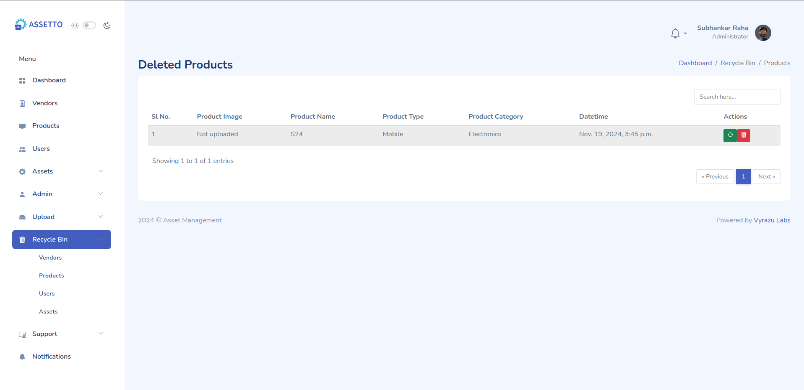

# Asseto - Asset Management Project

## Overview

**Asseto** is a comprehensive, enterprise-grade asset management solution designed to help organizations efficiently track, maintain, and allocate assets. It offers robust feature sets for asset lifecycle tracking, role-based user access controls, multi-factor authentication, administrative soft-deletes with a recycle bin, and customizable notification systems.

The system is built on Django with a clean, responsive web dashboard and supports a companion Flutter mobile application.

## Table of Contents

- [Features](#features)
- [Installation](#installation)
- [Usage](#usage)
- [Unit Testing](#unit-testing)
- [Configuration](#configuration)
- [Contributing](#contributing)
- [Releasing](#releasing)
- [Changelog](CHANGELOG.md)
- [Roadmap](#roadmap)
- [License](#license)
- [Contact](#contact)

## Features

### Core Asset Lifecycle & Inventory
- **Admin Dashboard**: Maintain detailed records of all Assigned Users, Locations, Departments, Product Types, Product Categories, and Roles.
- **Asset Assignment & Custody**: Assign assets to users, track reassignments, and manage active custody logs.
- **Asset Configuration Management**: Define custom specification fields and category-based templates for diverse asset classes.
- **Asset Repair Logs**: Track asset repair histories, maintenance costs, status changes, and servicing vendors.
- **Consumables Management**: Inventory tracking, stock level alerts, and distribution management for office accessories.
- **Bulk Uploads**: Import lists of Vendors, Locations, Departments, Categories, and Products via standard templates.

### Security, Auditing & Administration
- **Two-Factor Authentication (2FA)**: Strengthen user accounts using dynamic TOTP authenticator code verification.
- **Audit Logs & Soft Delete**: Auto-log administrative data modifications and recover records via a central Recycle Bin.
- **Role-Based Access Control**: Restrict interface access and action permissions using custom workspace roles.

### Portals & Customer Support
- **Client Portal**: Let external rental clients log in to view rented assets and manage active support requests.
- **Support Ticket Management**: Issue reporting, tracking, and resolution workflows for asset and client support queries.

### Integration & Multi-Channel Sync
- **Mobile Application**: Flutter-based mobile companion app for remote management and physical audits.
- **API for Third-Party Integrations**: Secure REST API endpoints to read and synchronize asset data with external systems.
- **Slack Integrations**: Push immediate alerts and updates to Slack workspace channels.
- **Flexible Notifications**: Coordinate multi-channel notifications across Email and Firebase (FCM) push alerts.
- **Multi-Language Support**: Complete interface internationalization (i18n) for global teams.

## Installation

### Prerequisites

- [Python 3.9+](https://www.python.org/)
- [MySQL](https://www.mysql.com/) (Can be replaced by your preferred database)
- [Docker](https://www.docker.com/) (optional, for containerized deployment)

### Steps

1. Clone the repository:
    ```sh
    git clone https://github.com/VyrazuLabs/asseto-asset-management.git
    cd asseto-asset-management
    ```

2. Create and activate a virtual environment:
    ```sh
    python -m venv env
    source env/bin/activate  # On Windows use `env\Scripts\activate`
    ```

3. Install dependencies:
    ```sh
    pip install -r requirements.txt
    ```

4. Set up environment variables:
    ```sh
    cp .env.example .env
    ```
    Edit the `.env` file with your preferred settings.

5. Apply migrations:
    ```sh
    python manage.py migrate
    ```

6. Start the development server:
    ```sh
    python manage.py runserver
    ```

7. Open your browser and navigate to `http://localhost:8000`.

8. Create a superuser if necessary:
    ```sh
    python manage.py createsuperuser
    ```

## Usage

#### Try This Project with a Demo Account
You can try a live demo before downloading the project code.
The demo instance is hosted [here](https://asset-management-hg2x.onrender.com/login?next=/).

**Credentials:**
- **Email:** `asset-management@demo.com`
- **Password:** `DM4g476ZmQ$U`

---

### Admin Section


1. Navigate to the **Admin** section in the side menu.
2. Manage Locations, Departments, Product Types, Product Categories, and Roles.
3. Perform standard CRUD actions (Add, Edit, View, Delete) on configurations.

### Vendors


1. Navigate to the **Vendors** section.
2. Click actions to Add, Edit, View, or Delete vendors.
3. Use search filters or download vendor lists as needed.

### Products


1. Navigate to the **Products** section.
2. Add new product lines or view product specifications.
3. Manage categories and inventory counts.

### Users


1. Navigate to the **Users** section to view registered accounts.
2. Grant permissions, assign roles, or register new users.

### Assets


1. Navigate to the **Assets** section.
2. Create/edit asset profiles and assign them to users.
3. Manage state transitions (e.g., Reassign, Unassign).

### Upload


1. Navigate to the **Upload** section.
2. Download sample CSV templates for Locations, Departments, Product Types, Categories, and Vendors.
3. Upload completed sheets for fast bulk data insertion.

### Recycle Bin


1. Access the **Recycle Bin** from the settings panel.
2. View soft-deleted records grouped by category.
3. Restore items back to active tables or permanently purge them.

---

### Security & Advanced Features

#### Two-Factor Authentication (2FA)
2FA can be toggled on/off in the User Profile section.
- **When Enabled**: Scan the provided QR code with any standard Authenticator App (Google Authenticator, Authy, etc.) to link the account. Subsequent logins will require a dynamic OTP code.
- **When Disabled**: Falls back to password-only validation.

#### Notifications & Firebase Integration
Custom notification channels can be enabled or disabled in the Profile settings.
- **In-App & Mobile Push Alerts**: Require Firebase integration.
- Place your `firebase-credentials.json` in the project root, or encrypt its contents using a Fernet key, placing the output data and the Fernet key in your `.env` file.

---

## Unit Testing

To ensure the quality and reliability of the system, unit tests are written to cover core backend functionality.

### Running Unit Tests

1. **Activate your virtual environment**:
    ```sh
    source env/bin/activate  # On Windows use `env\Scripts\activate`
    ```

2. **Run all tests**:
    ```sh
    python manage.py test
    ```

3. **Run tests for a specific app**:
    ```sh
    python manage.py test assets
    ```

4. **Run with Verbose Output**:
    ```sh
    python manage.py test -v 2
    ```

5. **Run without recreating the test database**:
    ```sh
    python manage.py test --keepdb
    ```

---

## Configuration

Configuration options are managed via the `.env` file. Key settings include:

- Database credentials (MySQL/PostgreSQL)
- SMTP server credentials for email dispatch
- Firebase settings & Fernet keys
- Django CSRF & Allowed Hosts lists

Copy the template settings from `.env.example` to `.env` to configure your local setup.

---

## Roadmap

The current status and planned milestones of the project are outlined below. For the detailed list of individual milestone goals, open pull requests, and tracking issues, please refer to the full [ROADMAP.md](ROADMAP.md).

### Core Web Application Milestones
| Status | Milestone | Goals Completed |
| :---: | :--- | :---: |
| 🟡 | **[Asset Configurations & Lifecycle Management](ROADMAP.md#asset-configurations--lifecycle-management)** | 1 / 3 |
| 🟡 | **[Security & Audit Systems](ROADMAP.md#security--audit-systems)** | 2 / 3 |
| 🔵 | **[Localization & User Preferences](ROADMAP.md#localization--user-preferences)** | 0 / 1 |

### Integrations & APIs Milestones
| Status | Milestone | Goals Completed |
| :---: | :--- | :---: |
| 🔵 | **[Third-Party API & Communication](ROADMAP.md#third-party-api--communication)** | 0 / 2 |

### Client Portal & Support Milestones
| Status | Milestone | Goals Completed |
| :---: | :--- | :---: |
| 🔵 | **[Client Portal & Ticket Management](ROADMAP.md#client-portal--ticket-management)** | 0 / 2 |

### Mobile Application Milestones
| Status | Milestone | Goals Completed |
| :---: | :--- | :---: |
| 🔵 | **[Mobile Application Development](ROADMAP.md#mobile-application-development)** | 0 / 1 |

---

## Contributing

We welcome contributions from the community! To contribute:

1. Fork the repository.
2. Create a new branch (`git checkout -b feature/your-feature`).
3. Commit your changes (`git commit -m 'Add new feature'`).
4. Push to your fork (`git push origin feature/your-feature`).
5. Open a Pull Request.

Please ensure your code conforms to the specifications in [CONTRIBUTING.MD](CONTRIBUTING.MD).

---

## Releasing

To publish a new version of Asseto to GitHub, follow the step-by-step instructions in [RELEASING.md](RELEASING.md).

It covers:
- Versioning conventions (SemVer)
- Pre-release checklists (tests, security audit, changelog updating)
- Branch workflows and tagging
- Creating official GitHub Releases

---

## License

This project is licensed under the MIT License. See the [LICENSE.md](LICENSE.md) file for more details.

---

## Contact

For any inquiries or support, please contact:

- **Email**: info@vyrazu.com
- **Project Maintainer**: [Vyrazu Labs Ltd](https://vyrazu.com/)
